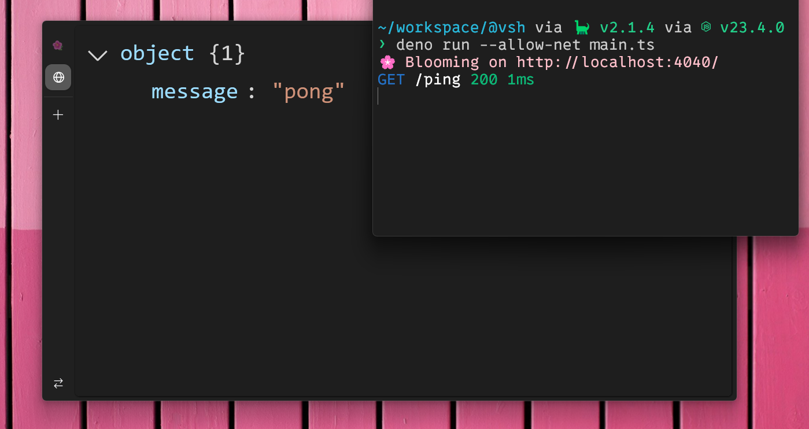

# Sakura 🌸 (WIP)



Sakura is a Deno HTTP framework build with zero dependencies,

## Installation

Install Sakura in your Deno project using this command:

```sh
deno add jsr:@vsh/sakura
```

## Example

```ts
import { bloom, fall, pluck, sakura } from "@vsh/sakura"

// Define the time we started server at
const uptime = Date.now()

// Seed is generated on every request. We can pass any utilities inside of it.
const { branch, seed } = sakura((req) => ({
  req,
  runtime: Date.now() - uptime,
}))

// Create branch with /ping, /runtime and /secret endpoints
const main = branch()
  .get("/ping", () => fall(200, { message: "pong" }))
  .get("/runtime", ({ seed: { runtime } }) => fall(200, { runtime }))
  .with((seed) => {
    // get `SECRET` header
    const secret = seed.req.headers.get("SECRET")

    if (!secret) {
      // exit mutation with the response
      throw pluck(400, {
        message: "secret is not provided",
      })
    }

    // return new seed
    return {
      ...seed,
      secret,
    }
  })
  .get("/secret", ({ seed: { secret } }) => fall(200, { secret }))

// start the server
bloom({
  // Seed generator
  seed,
  // Main branch
  branch: main,

  // Runs on error
  error: () => fall(500, { message: "try again later" }),
  // Runs if petal is not found
  unknown: () => fall(404, { message: "unknown endpoint" }),

  port: 4040,
  logger: true,
})
```

<!-- TODO: docs -->